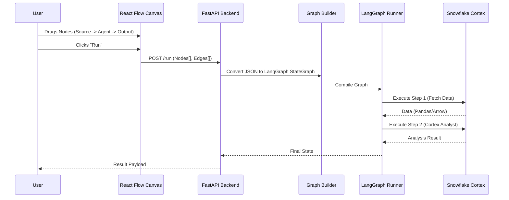

# SnowFlow Architecture Documentation

This document serves as the single source of truth for the SnowFlow architecture. It is designed to be machine-readable and visually renderable (via Mermaid).

## 1. High-Level System Overview

SnowFlow is a low-code UI for building Snowflake Intelligence Agents. It translates a visual graph of nodes into an executable `LangGraph` workflow that runs against Snowflake Cortex.

```mermaid
graph TD
    User[User / Browser]
    FE[Frontend SPA<br/>(React + React Flow)]
    BE[Backend API<br/>(FastAPI + Uvicorn)]
    LG[LangGraph Orchestrator]
    SF[Snowflake Cloud]
    
    User -->|Interacts| FE
    FE -->|JSON Graph Payload| BE
    BE -->|Compiles to| LG
    LG -->|Executes Agents| SF
    SF -->|Query Results| LG
    LG -->|Stream Status| BE
    BE -->|SSE / WebSocket| FE
```

## 2. Technology Stack (Lean & Simple)

| Component | Tech Choice | Justification |
| :--- | :--- | :--- |
| **Frontend** | React (Vite) | Fast build, industry standard. |
| **Visual Engine** | React Flow | Best-in-class library for node-based UIs. |
| **State Manager** | Zustand | Minimalist state management (no Redux boilerplate). |
| **Styling** | Tailwind CSS | Utility-first, zero runtime overhead. |
| **Backend** | FastAPI (Python) | Native async support, auto-docs, lean. |
| **Orchestrator** | LangGraph | Graph-native agent orchestration (fits UI model). |
| **AI/Data** | Snowflake Cortex | In-database LLM inference (secure, zero data movement). |

## 3. Data Flow: From Canvas to Execution

This describes how a visual diagram becomes a running agent.



## 4. Directory Structure

We enforce a strict, flat structure to minimize nesting and complexity.

```text
snowflow/
├── ARCHITECTURE.md          # This file (Source of Truth)
├── frontend/                # React Application
│   ├── src/
│   │   ├── components/      # Reusable UI atoms (Button, Card)
│   │   ├── nodes/           # Custom React Flow Node definitions
│   │   ├── store.ts         # Zustand global state
│   │   ├── App.tsx          # Main Canvas layout
│   │   └── main.tsx         # Entry point
│   ├── package.json
│   └── vite.config.ts
├── backend/                 # Python API
│   ├── main.py              # FastAPI Entry point & Routes
│   ├── graph_builder.py     # Logic to map JSON -> LangGraph
│   ├── snowflake_client.py  # Snowflake connection singleton
│   ├── requirements.txt
│   └── .env                 # Secrets (Snowflake Creds)
└── README.md
```

## 5. Current State (Live Updates)

*   [x] Architecture Defined
*   [ ] Frontend Scaffolded
*   [ ] Backend Scaffolded
*   [ ] Visual Nodes Implemented
*   [ ] LangGraph Integration
